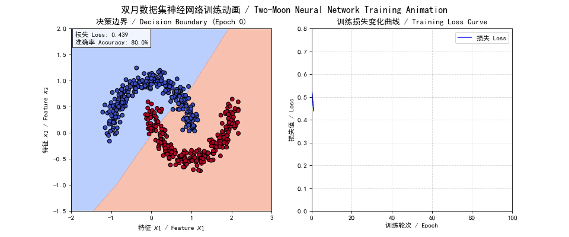

双月数据集 + 神经网络 + 动态可视化（含中文字体）

Two Moon Dataset + Neural Network Training + Animation + (Chinese and English)

简明神经网络 申富饶
读书课后练习

Usages:
1. start the program without argument, The animation will open in a new window.        
`python two_moon_training_with_loss.py`
2. start the program with "gif" argument, the animation will be saved to a gif file  
`python two_moon_training_with_loss.py gif`  
GIF file saved two_moon_training.gif  

